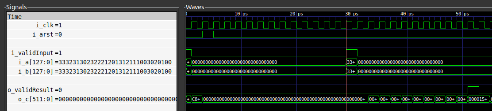
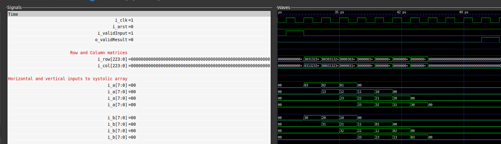

# 2D-Systolic-Array-Multiplier

This repository implements a synthesizable two dimensional systolic array that
can be configured to multiply 2 square matrices of dimensions > 2 and dimensions
< 17.

The `rtl` sub-directory contains the RTL written in System Verilog and the `tb`
sub-directory contains the test bench written in C++ and simulated using
Verilator.

## TL;DR

Requirements: `Verilator` and `GNU Make`.

To simulate the TB generating random NxN input matrices, driving the DUT ports
and displaying the result matrix generated by the DUT:

1. Clone the repository:
```
git clone https://github.com/tms4517/2D-Systolic-Array-Multiplier.git
```
2. By default the RTL and TB are configured to a matrix size of 4x4.

To modify the default matrix size: `cd rtl`, open `topSystolicArray.sv` and
modify the paramater `N`. And, `cd tb`, open `tb_topSystolicArray.sv` and modify
the macro `N`.

1. Run the simulation:
```
cd tb && make all
```

## Introduction

### Systolic architectures

(describe and explain seminal paper: "Why Systolic Architectures?": https://www.cse.wustl.edu/~roger/560M.f17/01653825.pdf)

### Existing implementations

(describe Google's TPU. Blog: https://cloud.google.com/blog/products/ai-machine-learning/an-in-depth-look-at-googles-first-tensor-processing-unit-tpu. Paper: https://arxiv.org/pdf/1704.04760.pdf)

## Design Outline

Interfacing to the top level module - `topSystolicArray.sv` has been kept simple.
Besides `i_clk` and `i_arst`, there are two input ports to drive the matrices A
and B - `i_a` and `i_b`. These ports are sampled, when the input port
`i_validInput` is asserted. The input matrices are then transformed and passed
to the systolic array for multiplication. When the matrix multiplication has
completed, output port `o_validResult` is asserted and the result matrix - `o_c`
can be sampled.

The waveform below shows the interface being exercised.


The elements of the input matrices are 8 bit integers. This was chosen out of
simplicity and provides an appropriate level of accuracy for neural network
calculations, as described in Google's TPU blog post. Furthermore, the elements
of the output matrix are set to 32 bits. This was chosen out of convenience for
verifying any NxN input matrix in the range 2 < N < 17.

The overall steps involved in performing the matrix multiplication using the
systolic array follows the steps outlined in this YouTube video:
https://www.youtube.com/watch?v=cmy7LBaWuZ8 and are described below.
To align to it and make it easier to follow the steps, a 4x4 matrix will be used
as example.

### Set-up the row and column matrices

When `i_validInput` is asserted the input matrices are transformed and
registered into 'row' and 'column' matrices as shown below. For each row of
matrix `i_a`, the position of the elements are reversed, zeros are appended to
the MSB of the rows and each row is right shifted accordingly to form the 'row'
matrix. Each column of matrix `i_b` is transformed into a row, zeros are
appended to the MSB of the rows and each row is right shifted accordingly to
form the 'column' matrix.


### Pass the elements from the row and column matrices to the systolic array

The elements in the first column of the row matrix are connected to the
horizontal inputs of the systolic array. And, the elements in the first column
of the column matrix are connected to the vertical inputs of the systolic array.
This is shown below.


At every clock cycle of the multiplication process, the row and column matrices
are left shifted by 1 element to load new values into the systolic array. The
waveform below shows the signals on the horizontal and vertical ports of the
systolic array being loaded with new values at every clock cycle. After, 10
(3N-2) clock cycles the multiplication is complete.



The `README.md` file in the `rtl` sub-directory contains implementation specific
details.

## Verification Outline

A basic C++ test bench consisting of several functions to implement a specific
task was created. The test outline is show below:

Assert the asynchronous signal

Loop {

  Assert `i_validInput`
  Create random NxN matrices
  Drive the input ports `i_a` and `i_b` with these matrices

  When `o_validResult` is asserted
  Calculate the expected result matrix
  Verify that `o_c` is equal to the result matrix, if it isn't raise an error

}

The simulation prints out the input matrices and the expected result matrix. If
an error occurs, the output matrix received will also be printed and the
simulation will end.

Included in `tb` sub-repository is `matrixMultiplier.py`, a calculator that can
be used to verify the printed matrix output.

The `README.md` file in the `tb` sub-directory contains implementation specific
details.

## Further Work

(SIMD processor)
(unpacked data types to perform synthesis)

**STATUS**: RTL & TB complete. Documentation in progress.
